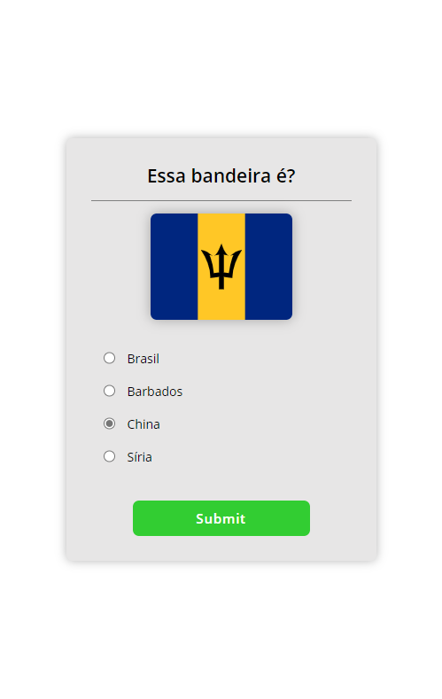

# flag-quiz

This app is a Flag Quiz that shows the user's score at the end of the Quiz.

# Technologies

In this project, I used React(create-react-app) and SASS.

I learned how to render Components based on state.

[This video was my inspiration to implement that app.](https://youtu.be/dtKciwk_si4).

## Result

> ### See the result live [here](https://flag-quiz-lusk1nha.vercel.app/)

Image -

